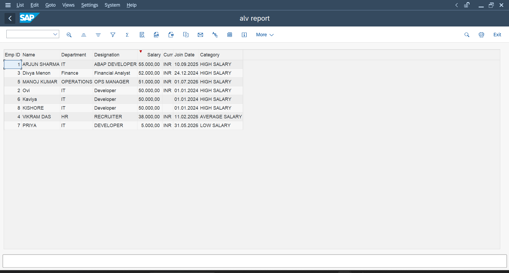
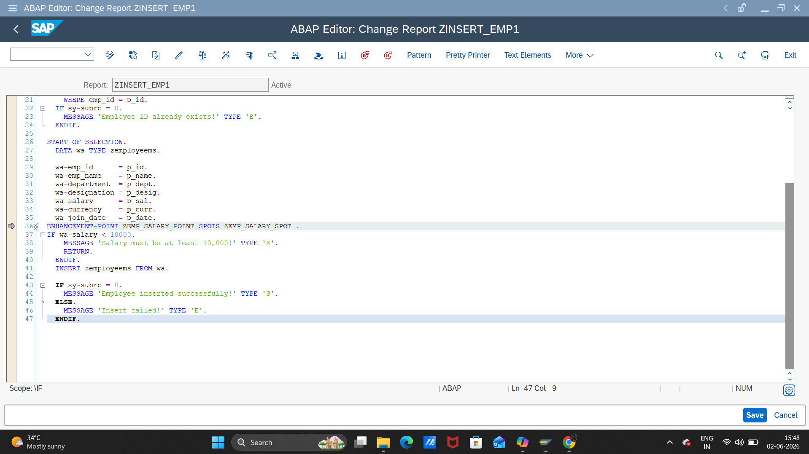
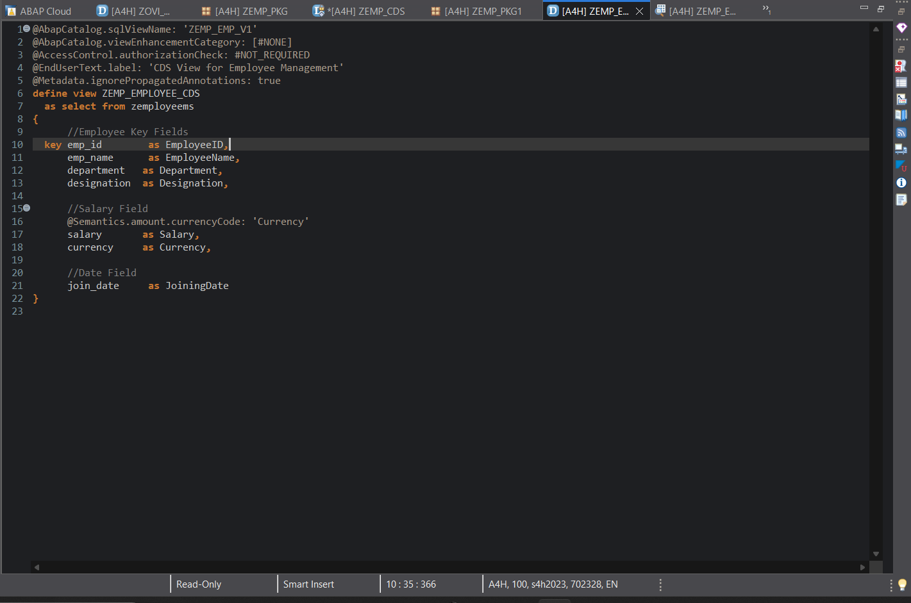
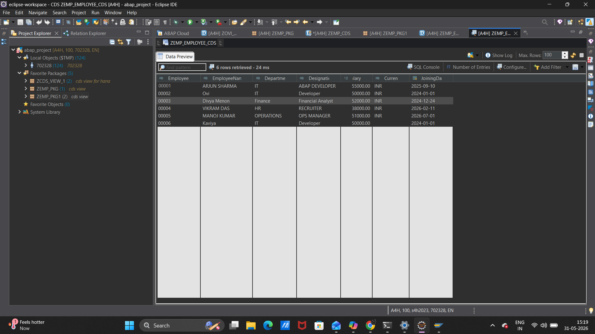

# Employee Management System (SAP ABAP / S4HANA)

## 📌 Overview
End-to-end Employee Management System built in SAP ABAP on S/4HANA.
Covers database design, full CRUD operations, ALV reporting, Function Module for salary classification, CDS View for HANA-optimized data access, and Enhancement Spot for salary validation before insert.

---

## 🧩 Features

- Custom table `ZEMPLOYEEMS` with domains and data elements (SE11)
- ABAP programs for:
  - Insert employee records with duplicate ID check (`ZINSERT_EMP1`)
  - Display employees with dynamic SELECT-OPTIONS filtering (`ZDISPLAY_EMP`)
  - Update employee fields selectively — only non-initial fields modified (`ZUPDATE_EMP`)
  - Delete employee with two-step Y/N confirmation (`ZDELETE_EMP`)
  - ALV report sorted by salary with salary category column (`ZALV_EMP`)
- Function Module `ZFM_SALARY_CATEGORY` to classify salary as HIGH / AVERAGE / LOW (SE37)
- CDS View `ZEMP_EMPLOYEE_CDS` for HANA-optimized data access with `@Semantics` annotations (Eclipse ADT)
- Enhancement Spot `ZEMP_SALARY_SPOT` with salary validation before insert — blocks records below minimum salary threshold (SE80)

---

## 📸 Screenshots

### 🔹 Insert Employee

### 🔹 Display Employees

### 🔹 Update Employee

### 🔹 Delete Employee

### 🔹 ALV Report

### 🔹 Enhancement Spot

### 🔹 CDS View

---

## 🚀 How to Run

1. Create table `ZEMPLOYEEMS` in SE11 using provided structure under `DATABASE/`.
2. Import all programs into SAP system via SE38 from `PROGRAMS/` folder.
3. Create Function Module `ZFM_SALARY_CATEGORY` in SE37 from `FUNCTION MODULES/` folder.
4. Create and activate CDS View `ZEMP_EMPLOYEE_CDS` in Eclipse ADT from `CDS VIEW/` folder.
5. Enhancement Spot `ZEMP_SALARY_SPOT` auto-triggers during insert validation — activate from `ENHANCEMENT/` folder.
6. Activate all objects.
7. Execute reports to insert, display, update, delete, and analyze employee data.

---

## 🛠 Skills Demonstrated

- SAP ABAP Data Dictionary (Domains, Data Elements, Transparent Tables)
- ABAP Reports (Classical, Selection Screens, ALV)
- Full CRUD with validation patterns (AT SELECTION-SCREEN, partial UPDATE, two-step DELETE)
- ALV Reporting (`REUSE_ALV_GRID_DISPLAY`) with DEFINE macro and sort
- Function Modules (SE37) with IV_/EV_ naming convention
- CDS Views — ABAP on HANA (Eclipse ADT) with `@Semantics.amount.currencyCode`
- Enhancement Spot / Enhancement Point (SE80)

---

## 🔧 Tools & Transactions Used

| Tool | Purpose |
|------|---------|
| SE11 | Data Dictionary — Table, Domain, Data Element |
| SE38 | ABAP Program Development |
| SE37 | Function Module |
| SE80 | Enhancement Spot & Object Navigator |
| Eclipse ADT | CDS View Development |
| S/4HANA | SAP System A4H, Client 100 |

---

## 👩‍💻 Author

**Oviyaa K**
B.Tech — Computer Science & Engineering
Manakula Vinayagar Institute of Technology, Puducherry
SAP ABAP S/4HANA Developer (Self-Study)